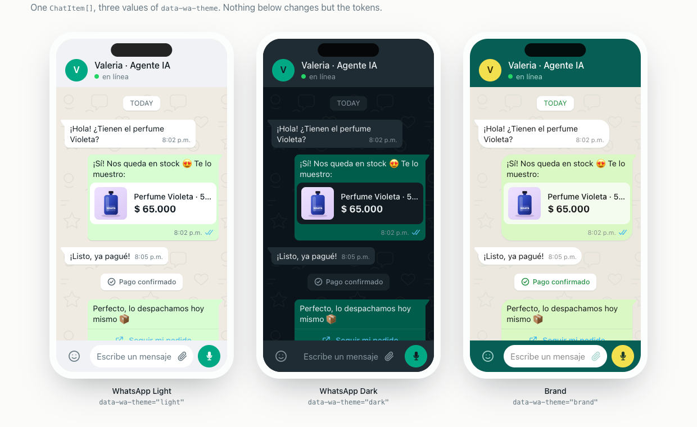

# WhatsApp Components

**A WhatsApp chat in React that passes for the real thing.** Tokens sampled from the app, bubble tails, blue ticks, three themes. Copy-paste components for [shadcn](https://ui.shadcn.com): the code lands in your repo, not your `node_modules`.

[**Live site**](https://whatsapp-components.crafter.run) · [Components](https://whatsapp-components.crafter.run/docs/whatsapp-kit) · [Playground](https://whatsapp-components.crafter.run/playground)



```bash
npx shadcn@latest add https://whatsapp-components.crafter.run/r/whatsapp-kit.json
```

That writes 36 files into your project and installs `clsx` and `tailwind-merge`. Nothing else. Take one component instead if that is all you need:

```bash
npx shadcn@latest add https://whatsapp-components.crafter.run/r/message-bubble.json
```

## Why this and not a chat library

**It is not a library.** There is no package to depend on, no version to bump, no maintainer between you and a one-line change. `shadcn add` writes the source into your project and you own it from then on. For chat UI that matters twice over, because everyone ends up changing the bubble radius or dropping their own card inside a message.

**The details are the point.** Anyone can render a green box. What makes a transcript read as WhatsApp is the tail on the first message of a run and not the rest, the timestamp that tucks into the last line when it fits and drops to its own line when it does not, two grey ticks turning one shade of blue, and a date divider that says Today, then Yesterday, then a weekday, then a date. All of that is here, and the rules behind it are tested rather than eyeballed.

**The colours are real.** Sampled from WhatsApp Web, not guessed: `#efeae2` wallpaper, `#d9fdd3` outgoing, `#005c4b` outgoing in the dark, `#53bdeb` read ticks.

**Server-renderable.** Only the composer is a client component. A transcript costs no JavaScript.

## Themes

Three themes ship as CSS custom properties. Set `data-wa-theme` on any ancestor and nothing else changes:

| Theme | What it is |
| --- | --- |
| `light` | WhatsApp Web's light theme, sampled |
| `dark` | WhatsApp Web's dark theme, sampled |
| `brand` | Rounder corners, deeper teal, for product shots and landing pages |

```tsx
<div data-wa-theme="dark">
  <MessageBubble direction="out" meta={<MessageMeta timestamp={sentAt} status="read" />}>
    ¡Sí! Nos queda en stock 😍
  </MessageBubble>
</div>
```

After adding, import the tokens once, after Tailwind:

```css
@import "tailwindcss";
@import "@/components/ui/whatsapp/whatsapp.css";
```

`themes.ts` exports the same values as typed objects, so a theme switcher is a `map` over `whatsappThemeList`.

## Two ways to write a chat

Compose the primitives when you want control:

```tsx
<ChatWindow>
  <ChatHeader name="Valeria · Agente IA" presence="online" presenceLabel="en línea" />
  <MessageList>
    <MessageGroup direction="in">
      <MessageBubble direction="in" tail meta={<MessageMeta timestamp={at} />}>
        ¿Tienen el perfume Violeta?
      </MessageBubble>
    </MessageGroup>
  </MessageList>
  <ChatInput placeholder="Escribe un mensaje" />
</ChatWindow>
```

Or hand `Conversation` a serialisable array and let it do the mapping:

```tsx
const items: ChatItem[] = [
  { kind: "date", id: "d", date: today },
  {
    kind: "message",
    id: "1",
    direction: "in",
    timestamp: at,
    content: { type: "text", text: "¿Tienen el perfume Violeta?" },
  },
  {
    kind: "message",
    id: "2",
    direction: "out",
    timestamp: at,
    status: "read",
    content: { type: "product", title: "Perfume Violeta · 50 ml", price: "$ 65.000" },
  },
  { kind: "system", id: "s", tone: "success", text: "Pago confirmado" },
];

<Conversation items={items} />;
```

`Conversation` handles every content type and takes a `renderContent` escape hatch for the cases a data model should not absorb. The [playground](https://whatsapp-components.crafter.run/playground) builds a conversation and exports it in either shape.

### The type model

Timestamps, direction, delivery status, quoted replies and reactions live on the message envelope, not on the content. A voice note and a product card get forwarded, quoted and read-receipted identically, so `MessageGroup` and `MessageTicks` never narrow on what a message contains:

```ts
type ChatItem = Message | SystemNotice | DateDividerItem;

type Message = {
  kind: "message";
  id: string;
  timestamp: Date;
  direction: "in" | "out";
  status?: "pending" | "sent" | "delivered" | "read";
  replyTo?: QuotedMessage;
  reactions?: Reaction[];
  content: MessageContent; // text | image | audio | document | location | product | list | cta | poll
};
```

## What is in the box

**Shell** `chat-window` · `chat-header` · `chat-avatar` · `chat-background` · `message-list` · `chat-input` · `phone-frame`

**Messages** `message-bubble` · `message-group` · `message-meta` · `message-ticks` · `date-divider` · `system-message` · `typing-indicator` · `reply-quote` · `reactions`

**Rich content** `image-message` · `audio-message` · `voice-note` · `document-message` · `location-message` · `link-preview`

**Commerce** `product-card` · `quick-reply-buttons` · `cta-button` · `list-message` · `poll`

**Foundations** `conversation` · `whatsapp-tokens` · `chat-grouping`

**Everything at once** `whatsapp-kit`

Every item is self-contained: `shadcn add message-bubble` brings the files it needs and nothing you did not ask for. Each has a [page](https://whatsapp-components.crafter.run/docs/whatsapp-kit) with a live preview in all three themes, a props table read out of the source, and the exact code that renders the preview.

## Development

```bash
bun install
bun run dev        # generates, then serves the dashboard on :4320
bun test
bun run typecheck
bun run lint
bun run build
```

`registry/whatsapp` is the canonical source. The dashboard imports it directly, with no build step between the two, so what you see on the site is exactly what `shadcn add` writes into your project.

The parts that break in silence are held by tests rather than by care: `themes.ts` and `whatsapp.css` cannot drift apart, every source file has to be shipped by a registry item with its imports resolvable, only the composer may carry `"use client"`, and the generated props and demo tables have to match the code they came from.

## License

MIT
